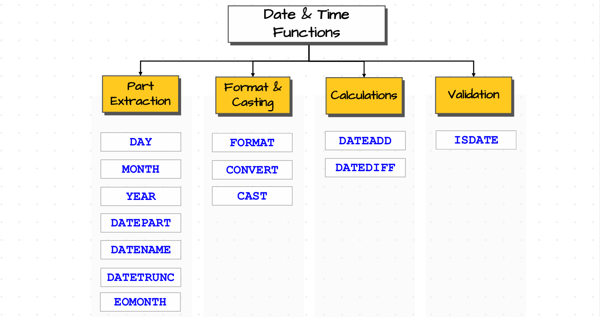

# Date and Time Functions

## Introduction

- A Date in SQL represents a date particular event happened such as birthday, project deadline or order placed day etc. The date format in SQL contains 3 components. Those are year, month and day. Month is in the range of 0 to 12 and day is in range of 1 to 31 depending upon the month. So format is `year-month-day`. Example for date is `2025-04-12`.

- Time in SQL represents a specific point within a day. It also consists of 3 components. Those are hour, minutes, seconds. Hour ranges from 0 to 23, minutes and seconds ranges from 0 to 59. Fromat of time is `hour-minutes-seconds`. Example for time is `18:25:46`.

- There is anothor data type in SQL which is called as Timestamp (in PostgreSQL, MySQL, Oracle) or datetime (in SQL Server) which is combination of date and time which represents exact time and date an event happened. Example for timestamp or datetime is `2025-04-12 18:25:46`.

- As we know what date and time is, now lets see what operations we can perform on date and time. We can majorly perform 4 different types of operations on date and time. We can extracts the parts of the date such as year, month, day, format the date or time in different formats, perform so calculations on date such as addition of two dates or finding the difference between two dates etc and validate the data in sql such as checking particular date is valid or not. Based on these we can divide the date and time functions into four categories such as Extraction, Format & Casting, Calculations and Validation which is shown in below image.

  <p align="center">
  
  <br>
  <em>Date and Time Functions</em>
  </p>

## Date Extraction Functions

### DAY, MONTH, YEAR Functions

- DAY() function is used to extract day from the date, MONTH() function is used to extract month from the date and YEAR() function is used to extract year from the date. Input can be date or datetime. The basic syntax of three functions is `func(<date>)`. Here func can be anyone of DAY(), YEAR() or MONTH().

- **Ex** : Extract the DAY, Month and year of the a customer's order.

  ```sql

  SELECT
  OrderID,
  CreationTime,
  DAY(CreationTime) as Day,
  MONTH(CreationTime) as Month,
  YEAR(CreationTime) as Year
  FROM Sales.Orders

  ```

### DATEPART Function

- DATEPART() function in SQL is used to return the specific parts of a DATE as an integer. It can be year, month, day, quarter (1 to 4), dayofyear (1 to 366), week ( week number in year : 1 to 52), weekday (day of the week mean Sunday-1, Monday-2 etc), hour, minute, second, millisecond etc. Anyway it would return all parts as an integer only

- Basic syntax of DATEPART() is `DATEPART(<datepart>,<date>)`.

- **Ex** : Extract all possible parts from Customers Order CreationTime.

  ```sql

  SELECT
  OrderID,
  CreationTime,
  DATEPART(day,CreationTime) as day_dp,
  DATEPART(month,CreationTime) as month_dp,
  DATEPART(year, CreationTime) as year_dp,
  DATEPART(quarter,CreationTime) as quarter_dp,
  DATEPART(week,CreationTime) as week_dp,
  DATEPART(weekday,CreationTime) as weekday_dp,
  DATEPART(dayofyear,CreationTime) as dayofyear_dp,
  DATEPART(hour,CreationTime) as hour_dp
  FROM Sales.Orders;

  ```

### DATENAME Function

- DATENAME() function is used to return the specific parts of the date as string. That means we can return day, month, year, week, weekday, dayofyear, hour, minute, second as string. Since we have names for month and weekday only such as August, Monday and all other doesn't have any name so we get values but stored as string.

- Basic Syntax of DATENAME() function is `DATENAME(part,date)`.

- **Ex** : Extract Month and weekday name from Customers Order CreationTime.

  ```sql

  SELECT
  OrderId,
  CreationTime,
  DATENAME(month,CreationTime) as month_dn,
  DATENAME(weekday,CreationTime) as weekday_dn,
  DATENAME(year,CreationTime) as year_dn
  FROM Sales.Orders

  ```

### DATETRUNC Function

- DATETRUNC() function is used to extract the data information upto certain level and return output in datetine format itself. As we know, datetime format has multiple levels but majorly we see six levels. Those are year, month, day, hour, minutes, seconds. Suppose if you want the datetime upto just minute level then DATETRUNC make seconds to 00 and keep until minute level only. 

- For example, we have datetime value as `2025-04-12 18:25:46` and you want only until minute level then DATETRUNC makes seconds as 00 and returns `2025-04-12 18:25:00` as output. If you want hour level then it returns `2025-04-12 18:00:00`. If you want day level then it returns `2025-04-01 00:00:00`. If you want month level then puts 01 in place any day to make it start of the month and returns `2025-04-01 00:00:00`. If you want year level then it makes month as 01 which starting month of the year and returns `2025-01-01 00:00:00`. So DATETRUNC actually takes smallest level parts based on the level you mentioned and makes those parts to its minimum values as we know the minum values of hours, minutes, seconds are 00 and month, day are 01.

- Basic Syntax of DATETRUNC is - `DATETRUNC(<part>,<date>)`. Here part can be year, month, day, hour, minute, seconds etc.

- **Ex** : Extract the day level info Customers order Creationtime.

  ```sql

  SELECT
  OrderId,
  CreationTime,
  DATETRUNC(day, CreationTime) as day_tr
  FROM Sales.Orders

  ```

- These DATETRUNC() function are majorly used to perform the aggregation and analytics tasks. Suppose you have only Order creation time only and you want to know how many orders we got each month in this year then how can we get that one by truncating the date to month level and perfrom aggregations by using group by.

  ```sql

  SELECT
  DATETRUNC(month,CreationTime) as month_tr,
  Count(*)
  FROM Sales.Orders
  GROUP BY DATETRUNC(month, CreationTime)

  ```

- **Note** : DATETRUNC() only pushes to period boundaries if that datepart represents period in a year. If you see dayofyear is not a period in a single year. It just represents the ordinal number or label inside a year which is current day from start of the year such as 80th day in this year etc. So it maynot used in DATETRUNC() as it behaves like day in DATETRUNC() as period is that day iteself. It just used in date extraction part like DATEPART() function to acesses the seasonal trends in sales etc.

### EOMONTH Function

- EOMONTH() function returns the end data of the month as output. Suppose if you date is `2025-06-12` then EOMONTH() function returns the `2025-06-30` as output.

- Basic syntax of EOMONTH() is `EOMONTH(<date>)`.

- **Ex** : Get the End of the Month for each customers order creationtime.

  ```sql

  SELECT
  OrderID,
  CreationTime,
  EOMONTH(CreationTime) as Endofmonth
  FROM Sales.Orders

  ```